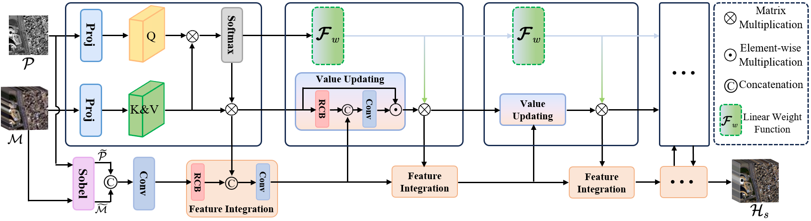
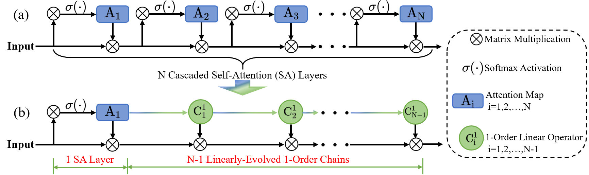
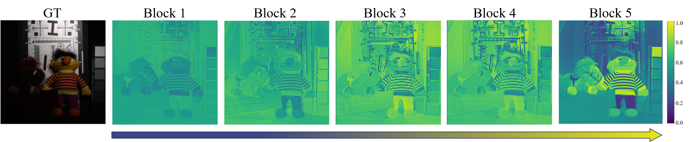

#  LFormer

Official Implementation of LFormer (Accepted to ACM MM2024).  Complete code will be released soon!

### BiMPan
#### Overall Structure

#### Illustration of the Linear Chains

#### Feature Maps

# Notes
We provide the pre-trained weights on WV3 dataset. You can train the model on your datasets. 
# Dataset
Datasets: [Pansharpening](https://github.com/liangjiandeng/PanCollection) and [Hyperspectral](https://github.com/shangqideng/BDT).

# Contact
If you have any questions, please feel free to contact junming_hou@seu.edu.cn, iamzihan666@gmail.com.
